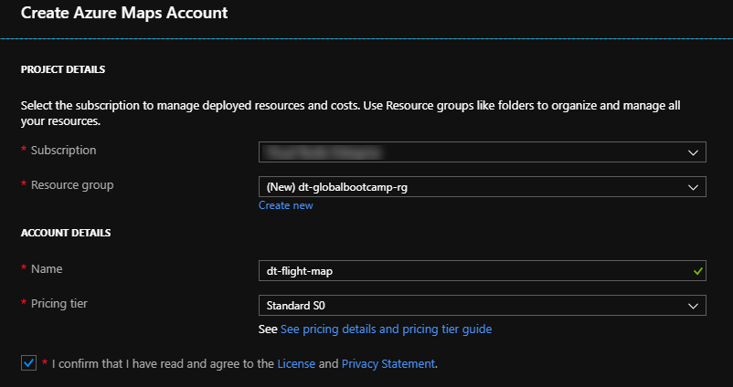
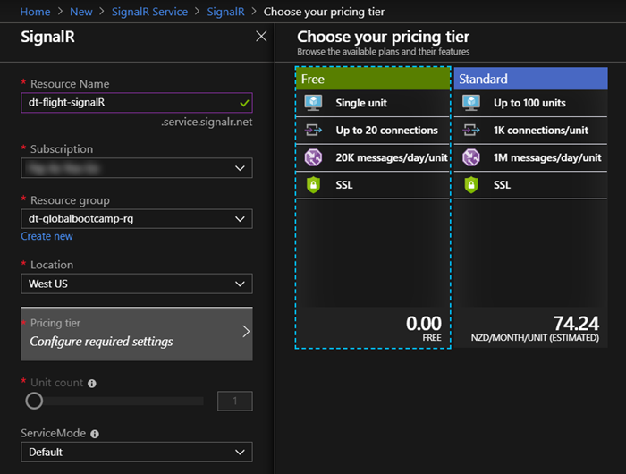
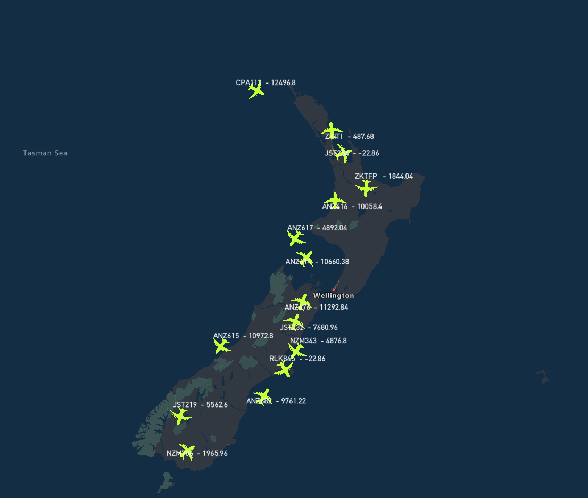

# Real Time Flight Map w/ Azure Functions, CosmosDB & SignalR

## What we will cover

In this workshop we will be building a (near) real-time flight tracker app that leverages several Azure technologies.

- We will be using Azure Maps to draw the map canvas in our web app.
- To get the flight information, we will create a timer triggered Azure Function to pull the latest flight data set from the OpenSky Network public API. The flight data will then be persisted in a Cosmos Database.
- We will then create an Azure Function that listens to the Cosmos DB change feed and updates an Azure SignalR hub with all changes to the flight data. 
- Finally the web app will be configured with a SignalR client to handle the data changes in real-time.

## What you will need

- Microsoft Azure Account
- Visual Studio 2017
- Azure Function CLI Tools *(Will be downloaded automatically when debugging functions locally)*

# Creating the Azure Resources

## Azure Maps

[**Azure Maps from the docs**](https://docs.microsoft.com/en-us/azure/azure-maps/about-azure-maps)

*Azure Maps is a portfolio of geo-spatial services that include service APIs for Maps, Search, Routing, Traffic and Time Zones. The portfolio of Azure OneAPI compliant services allows you to use familiar developer tools to quickly develop and scale solutions that integrate location information into your Azure solutions. Azure Maps provides developers from all industries powerful geo-spatial capabilities packed with fresh mapping data imperative to providing geographic context to web and mobile applications.*

### Create a new Azure Maps resource

1. In the upper left corner of the portal, click on 
2. Type in **Maps** in the search bar and select **Maps** in the dropdown.
3. Click the **Create** button that appears on the Maps resource page

    

4. Enter the following information into the **Create Maps Account** template

    | Name              | Value |
    | ---               | ---   |
    | Subscription      | Select your subscription
    | Resource Group    | Select the resource group created above
    | Name              | Give your maps account a meaningful name
    | Pricing Tier      | Select **Standard S0** [See Pricing Info](https://azure.microsoft.com/en-us/pricing/details/azure-maps/)

5. Read the **License and Privacy Statement** and select the checkbox.

    

6. Once the new Azure Maps resource has been provision, navigate to the newly deployed resource and locate the **Authentication** tab under the **Settings** subheading. You will need to grab the key later on.

---

## Azure SignalR

[**Azure SignalR from the docs**](https://docs.microsoft.com/en-us/azure/azure-signalr/signalr-overview)

*Azure SignalR Service is an Azure managed PaaS service to simplify the development, deployment and management of real time web application using SignalR, with Azure supported SLA, scaling, performance and security. The service provides API/SDK/CLI/UI, and rich set of code samples, templates, and demo applications.*

### Create a new Azure SignalR resource

1. In the upper left corner of the portal, click on 
2. Type in **SingalR** in the search bar and select **SignalR Service** in the dropdown.
3. Click the **Create** button that appears on the SignalR Service resource page

    

4. Enter the following information into the **Create SignalR Service** template

    | Name              | Value |
    | ---               | ---   |
    | Resource Name     | Give your SignalR Service a meaningful name
    | Subscription      | Select your subscription
    | Resource Group    | Select the resource group created above
    | Location          | Select a location to deploy your SignalR Service too
    | Pricing Tier      | Select the **Free** tier [See Pricing Info](https://azure.microsoft.com/en-us/pricing/details/signalr-service/)
 
    

5. Once the new SignalR Service has been provision, navigate to the newly deployed resource and locate the **Keys** tab under the **Settings** subheading. You will need to grab the connection string later on.

---

## Azure Cosmos DB

[**Azure Cosmos DB from the docs**](https://docs.microsoft.com/en-us/azure/cosmos-db/introduction)

*Azure Cosmos DB is a fully managed, globally-distributed, horizontally scalable in storage and throughput, multi-model database service backed up by comprehensive SLAs. Azure Cosmos DB was built from the ground up with global distribution and horizontal scale at its core - it offers turn-key global distribution across any number of Azure regions by transparently scaling and replicating your data wherever your users are. You can elastically scale throughput and storage worldwide and pay only for the throughput and storage you need. Azure Cosmos DB guarantees single-digit millisecond latencies at the 99th percentile anywhere in the world, offers multiple well-defined consistency models to fine-tune for performance and guaranteed high availability with multi-homing capabilities - all backed by industry leading service level agreements (SLAs).*

*Azure Cosmos DB is truly schema-agnostic - it automatically indexes all the data without requiring you to deal with schema and index management. Azure Cosmos DB is multi-model - it natively supports document, key-value, graph and columnar data models. With Azure Cosmos DB, you can access your data using NoSQL APIs of your choice. Azure Cosmos DB is a fully managed, enterprise ready and trustworthy service. All your data is fully and transparently encrypted and secure by default. Azure Cosmos DB is ISO, FedRAMP, EU, HIPAA, and PCI compliant as well.*

### Create a new Azure Cosmos DB instance

1. In the upper left corner of the portal, click on 
2. Type in **Cosmos** in the search bar and select **Azure Cosmos DB** in the dropdown.
3. Click the **Create** button that appears on the Azure Cosmos DB resource page

    

4. Enter the following information into the **Create Azure Cosmos DB** template

    | Name              | Value |
    | ---               | ---   |
    | Subscription      | Select your subscription
    | Resource Group    | Select the resource group created above
    | Account Name      | Give your Cosmos DB a meaningful name
    | API               | Select the Core(SQL) API
    | Location          | Select a location to deploy your Cosmos DB too
    | Geo-Redundancy    | Not required so I chose to disabled it
    | Multi-Region      | Not required so left disabled by default
 
    

5. Click **Review + Create** and then once the validation has passed, select **Create**
6. Once the new Cosmos DB instance has been provision, navigate to the newly deployed resource and locate the **Keys** tab under the **Settings** subheading. You will need to grab the connection string later on.

# Creating the Web App

The web app we are going to build is a simple flight tracker app. 

## Create a new Map

1. Open up visual studio code and create a new project directory for this project.
2. In the new project folder create a subdirectory called `Web`
3. In the `Web` directory create a new file called `index.html` 
4. Copy the following boilerplate code and then we will fill rest.

```html
<!DOCTYPE html>
 <html>
 <head>
     <title>Live Flight Data Map</title>
     <meta charset="utf-8">
     <meta name="viewport" content="width=device-width, initial-scale=1, shrink-to-fit=no">

     <!-- Add references to the Azure Maps Map control JavaScript and CSS files. -->
     <link rel="stylesheet" href="https://atlas.microsoft.com/sdk/javascript/mapcontrol/2/atlas.min.css" type="text/css">
     <script src="https://atlas.microsoft.com/sdk/javascript/mapcontrol/2/atlas.min.js"></script>

     <!-- Add a reference to the Azure Maps Services Module JavaScript file. -->
     <script src="https://atlas.microsoft.com/sdk/javascript/mapcontrol/2/atlas-service.min.js"></script>

     <script>
     function GetMap(){
         //Add Map Control JavaScript code here.
     }
     </script>

     <style>
         html,
         body {
             width: 100%;
             height: 100%;
             padding: 0;
             margin: 0;
         }

         #myMap {
             width: 100%;
             height: 100%;
         }
     </style>
 </head>
 <body onload="GetMap()">
     <div id="myMap"></div>
 </body>
 </html>
```

5. Go ahead and grab the subscription key for your Azure Maps account that you created earlier.
6. Add the following javascript snippet to the `GetMap()` function and your subscription key to the placeholder.

```javascript
//Instantiate a map object
var map = new atlas.Map("myMap", {
    //Add your Azure Maps subscription key to the map SDK. Get an Azure Maps key at https://azure.com/maps
    authOptions: {
        authType: 'subscriptionKey',
        subscriptionKey: '<Your Azure Maps Key>'
    }
});
```

7. Save your changes and open your `index.html` file in a browser. You should now see a really basic map of the world.


## Customize your map

To keep things simple and to ensure that this map of the world include New Zealand, we will scope the map to New Zealand specifically.
Add the following options/settings to the `GetMap()` function, just below the `authOptions` section.

```javascript
style: "night",
center: [171.7799, -40.838875],
zoom: 6
```

Refresh the page in your browser and notice, the map is now zoomed in on New Zealand and we've made it dark! 
You might need to tweak the **center coordinates** and **zoom** settings to get a better fit for your screen size and if you are after different styles or other custom configurations, take a look at the **Map** component section of the docs.

- [Supported Styles](https://docs.microsoft.com/en-us/azure/azure-maps/supported-map-styles)
- [Map Control Docs](https://docs.microsoft.com/en-us/javascript/api/azure-maps-control/atlas.map?view=azure-iot-typescript-latest)


## Lets Add Some Flight Data!!

Sweet map... but you said there would be planes! Adding the flight data to the map is going to require a couple of things so lets kick right into it.

First we need to query the [OpenSky Network](https://opensky-network.org/apidoc/) API to get the flight data. The OpenSky Network provide open air traffic data for research and non-commercial purposes. They do provide more comprehensive licensing models should you need it but for the purposes of this workshop we will use the public endpoint.

To simplify matters further and reduce the payload size, given we have scoped our map map to just New Zealand, the RESTful calls to the public API contain the boundary coordinates for New Zealand so that we only fetch flight data for flights on our map.

In your browser or your favorite http client tool run the following GET request to the OpenSky Network API and familiarize yourself with the response body.

- [GET Request](https://opensky-network.org/api/states/all?lamin=-50.00&lomin=160.00&lamax=-30.00&lomax=180.00) `https://opensky-network.org/api/states/all?lamin=-50.00&lomin=160.00&lamax=-30.00&lomax=180.00`

Notice the **longitude** and **latitude** query params, these are just a rough estimate. Feel free to tweak these or make up your own all together. If you do change the location, don't forget to update your maps **center coordinates** we set in the previous step otherwise you won't see any flights in your region later on.

In the interest of brevity, I've listed the fields we will be making use of below. For the full list, checkout the [OpenSky Network API Docs](https://opensky-network.org/apidoc/rest.html#response)

| Index | Property          | Type      | Description
| ---   | ---               | ---       | ---
| 0     | icao24            | string    | Unique ICAO 24-bit address of the transponder in hex string representation.
| 1     | callsign	        | string	| Callsign of the vehicle (8 chars). Can be null if no callsign has been received.
| 2     | origin_country	| string	| Country name inferred from the ICAO 24-bit address.
| 5     | longitude	        | float	    | WGS-84 longitude in decimal degrees. Can be null.
| 6     | latitude	        | float	    | WGS-84 latitude in decimal degrees. Can be null.
| 7     | baro_altitude 	| float	    | Barometric altitude in meters. Can be null.
| 9     | velocity	        | float	    | Velocity over ground in m/s. Can be null.
| 10    | true_track	    | float	    | True track in decimal degrees clockwise from north (north=0°). Can be null.

In order to get the flight data, we will use the lightweight promis based HTTP client [Axios](https://github.com/axios/axios) to make a RESTful request to the OpenSky Network API with the request we just tested above. Add the following html script snippet to your `index.html` file to pull down the axios.js dependancies.

```html
    <!-- Promis based http client. https://github.com/axios/axios -->
    <script src="https://unpkg.com/axios/dist/axios.min.js"></script>
```

Now add the following simple method below the `GetMap()` function to retrieve the flight data. With the function in place, it's time to render the flights on the map.

```javascript
function GetFlightData() {
return axios.get('https://opensky-network.org/api/states/all?lamin=-50.00&lomin=160.00&lamax=-30.00&lomax=180.00')
    .then(function (response) {
        return response;
    }).catch(console.error)
}
```

Finally append the below code snippet to the `GetMap()`function. Here we are adding a ready event to the map so that this logic gets executed only after the map has been initialized.
The snippet below does the following

1. Add a image to use as the plane icon to the maps [ImageSprite](https://docs.microsoft.com/en-us/javascript/api/azure-maps-control/atlas.imagespritemanager?view=azure-iot-typescript-latest) collection. The `.png` referenced here is one that I created and is being served up from blob storage. Feel free to use this one or create your own graphics and get creative.

2. The next step is to create a new [DataSource](https://docs.microsoft.com/en-us/javascript/api/azure-maps-control/atlas.source.datasource?view=azure-iot-typescript-latest) which will keep track of the flight data within the map.

3. Next we create a new map [SymbolLayer](https://docs.microsoft.com/en-us/javascript/api/azure-maps-control/atlas.symbollayeroptions?view=azure-iot-typescript-latest) which describes how we want the flight data stored in the data source to be rendered on the map.

    - In the `iconOptions` section we set the image to the plane icon we added to the ImageSprite later earlier on.
    - We also set the **rotation** property of the icon using a function which fetches the value from the data source. This will be the **true_track** value in the flight data payload and "points" the icon in the same direction the flight is currently travelling.
    - In the `textOptions` we add some flight information text which is also fetched from the data source for specific flight. This will render information about the flight next to the icon on the map.

4. Finally make a call to the `GetFlightData()` function we created earlier and foreach flight in the response create a new map [Shape](https://docs.microsoft.com/en-us/javascript/api/azure-maps-control/atlas.shape?view=azure-iot-typescript-latest) and add it to the data source.

    - The **Shape** contains a GeoJSON [Point](https://docs.microsoft.com/en-us/javascript/api/azure-maps-control/atlas.data.point?view=azure-iot-typescript-latest) object which will store the coordinates of a given flight.
    - Then add some custom properties to the **Shape** to store the **Name, Altitude and Rotation** values of the flight which are used in the **SymbolLayer** above when rendering the flight information on the map.

```javascript
//Wait until the map resources are ready.
map.events.add('ready', function () {

    map.imageSprite.add('plane-icon', 'https://dtazfuncdemogsa.blob.core.windows.net/dt-azfuncdemo-blob/plane.png');

    //Create a data source and add it to the map
    var datasource = new atlas.source.DataSource();
    map.sources.add(datasource);

    //Create a symbol layer using the data source and add it to the map
    map.layers.add(
        new atlas.layer.SymbolLayer(datasource, null, {
            iconOptions: {
                ignorePlacement: true,
                allowOverlap: true,
                image: 'plane-icon',
                size: 0.08,
                rotation: ['get', 'rotation']
            },
            textOptions: {
                textField: ['concat', ['to-string', ['get', 'name']], '- ', ['get', 'altitude']],
                color: '#FFFFFF',
                offset: [2, 0]
            }
        }));

    GetFlightData().then(function (response) {
        for (var flight of response.data.states) {
            var pin = new atlas.Shape(new atlas.data.Point([flight[5], flight[6]]));
            pin.addProperty('name', flight[1]);
            pin.addProperty('altitude', flight[7]);
            pin.addProperty('rotation', flight[10]);
            datasource.add(pin);
        }
    });
});
```

Refresh your browser... and TaDa!! You should now see static plane icons on your map representing the actual flights currently over New Zealand. 



In Part 2 of the workshop we will now focus on building out the Azure Functions which will provide real time data updates for the flight data on our map

### Nuget Packages

- Microsoft.Azure.WebJobs.Extensions.CosmosDB
- Microsoft.Azure.WebJobs.Extensions.SignalRService